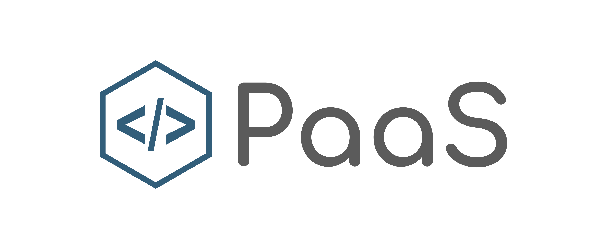

## Logo PaaS

You can use the [editor on GitHub](https://github.com/paas-info/logo/edit/master/README.md) to maintain and preview the content for your website in Markdown files.

# Font
https://fonts.google.com/specimen/Comfortaa

Font in use Comfortaa-Bold designed by Johan Aakerlund and licensed under Open Font License. Icon Designed by Rafael Mayrink

Font in use <a target="_blank" href="https://fonts.google.com/specimen/Comfortaa">Comfortaa-Bold</a> designed by
<a target="_blank" href="https://aajohan.deviantart.com/">Johan Aakerlund</a>
and licensed under
<a target="_blank" href="http://scripts.sil.org/cms/scripts/page.php?site_id=nrsi&amp;id=OFL_web">Open Font License.</a>
  Icon Designed by
  <a target="_blank" href="https://thenounproject.com/rflmyk">Rafael Mayrink</a>

## Icon Color
  
  #325E7A

## Text Color
  #5B5B5B

## 1

## 2

## 3

